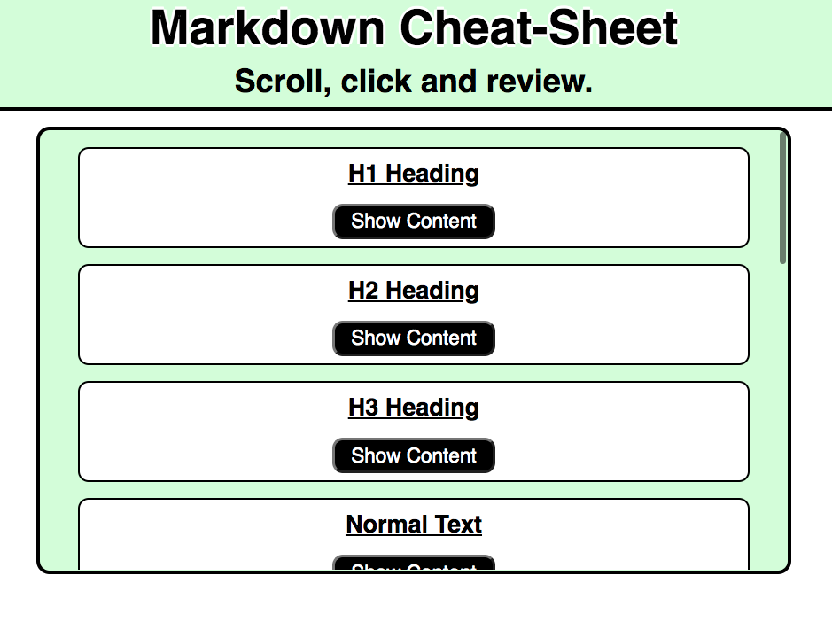
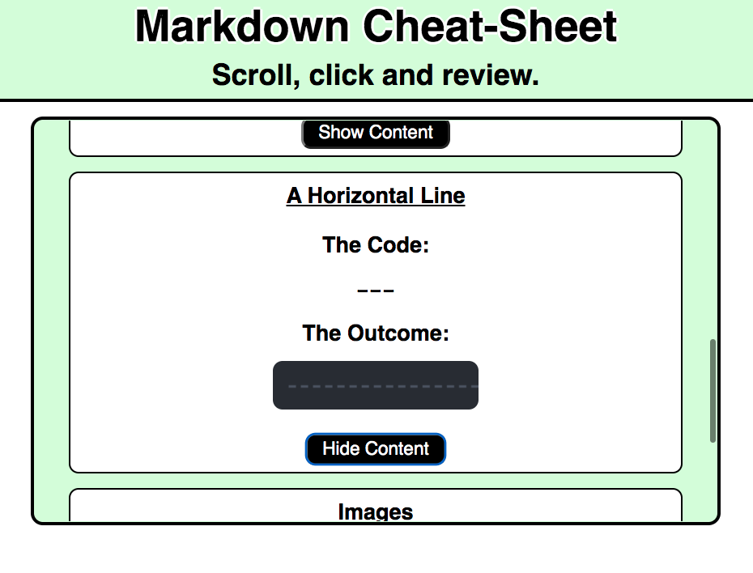
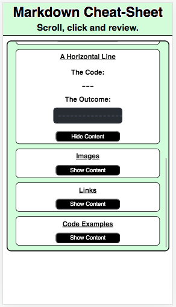

# Markdown Cheat-Sheet

This is a basic Markdown cheat-sheet.

---
## Build with:
* React.js
* CSS
---
## App Image: Starting Image.

---
## App Image: In-use Image.

---
## App Image: Responsive Example.

